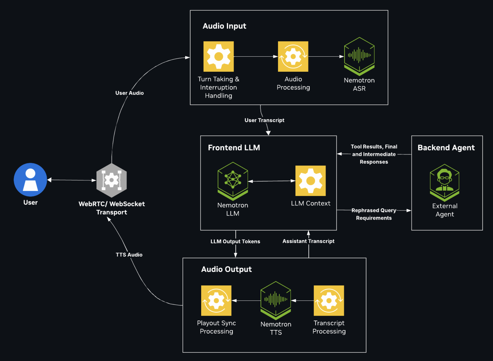

# Frontend/Backend Agent Cascaded Example

The Frontend/Backend Agent is one shared Pipecat voice pipeline with replaceable domain behavior. A fast Talker large language model (LLM) owns the conversation. A separate Thinker LLM plans work that requires tools, state, or domain policy. The pipeline includes airline and generic-assistant domains. You can add a read-only generic flavor without copying the audio pipeline or its tool implementation.

The agent is not a ReAct agent. The Talker can call only `call_backend` and
`cancel_backend`. A session-local backend asks the Thinker for bounded plans,
validates each plan in Python, runs the allowed domain tools, and returns a
structured result to the Talker. The generic backend can use up to 8 planning
rounds by default when later work depends on an earlier tool result. You can
change this limit without changing the planner implementation.

The OpenAI Realtime WebSocket can run this complete server-owned system or
expose client-owned delegation functions. Select
`nvidia/nemotron-realtime-generic-frontend-backend` to route client functions
through the Generic Thinker. The Talker still sees only `call_backend` and
`cancel_backend`; it receives a bounded capability digest with descriptions,
but no client function identifiers or argument schemas. The digest is
deterministic by default and can optionally be generated by the same Lightning
instance. The Thinker receives the complete client schemas and
`session.instructions` verbatim in its own system layer, while the trusted
planner contract remains separate. Refer to
[Configure Tools](../../../docs/how-to/use-realtime-gateway.md#configure-tools).



## Default Models

The `frontend-backend-agent` (airline) defaults in [`examples_registry.yaml`](../../../examples_registry.yaml) resolve to the following models for each profile. The `generic-frontend-backend-agent` entry keeps the same Talker and selects Nemotron 3 Super 120B A12B with reasoning enabled as its Thinker.

| Profile | ASR | Talker LLM | Thinker LLM | TTS |
| --- | --- | --- | --- | --- |
| Cloud | Nemotron ASR Streaming English | Nemotron 3.5 Lightning 30B A3B | Nemotron 3.5 Lightning 30B A3B with reasoning enabled | Magpie TTS Multilingual |
| Server | Nemotron ASR Streaming English NIM | Nemotron 3.5 Lightning 30B A3B NIM | Nemotron 3.5 Lightning 30B A3B NIM with reasoning enabled | Magpie TTS Multilingual NIM |
| Single GPU | Nemotron Speech Streaming English 0.6B through NeMo-Speech.cpp | Nemotron 3.5 Lightning 30B A3B through vLLM | Nemotron 3.5 Lightning 30B A3B through vLLM with reasoning enabled | Magpie TTS Multilingual through NeMo-Speech.cpp |

The Talker and Thinker use different runtime settings. The Talker disables
reasoning for lower latency. The Generic Server and Single GPU profiles give
the Nemotron 3 Super Thinker a 1,024-token reasoning budget and allow up to
2,048 output tokens. The Generic Cloud profile uses a 1,024-token reasoning
budget and allows up to 4,096 output tokens. The Airline Thinker uses its own
catalog settings.

## Request Flow

Each request follows the same path for every domain:

1. The transport receives user audio, and automatic speech recognition (ASR) produces a transcript.
2. The Talker answers stable conversational requests directly or calls `call_backend` with a self-contained request.
3. The session-local backend asks the Thinker for a plan. The selected registry entry controls the hidden Thinker prompt and the generic domain's maximum internal-tool allowlist. A browser session can narrow that tool set.
4. The generic planner appends a generated tool-contract block for only the effective session tools. The airline domain keeps its existing prompt-owned contracts. Domain code validates each plan before dispatch.
5. The backend runs the approved tools. For dependent generic work, it gives the Thinker the accumulated trusted results and allows another planning round. The backend stops after the configured round limit, when the Thinker signals completion, when the plan does not request another round, or when the overall backend deadline expires.
6. The generic backend combines results from every completed round in execution order. If a later round times out or fails, it returns the results already gathered instead of discarding them. It otherwise returns a structured `response_hint` or `tool_result`. The generic domain also generates user-facing capability text from the enabled tool specifications.
7. The runtime either speaks trusted `response_text` directly or asks the Talker for a concise reply. Text-to-speech (TTS) then produces audio.
8. `cancel_backend` cancels pending work, and a newer superseding request replaces it. Neither path lets a stale result reach the conversation. When the user only acknowledges or asks about progress while work runs, the new `call_backend` call can continue the running request instead of restarting it. Refer to [Continue Running Work and Share Session History](#continue-running-work-and-share-session-history).

For WebSocket sessions, the browser client supplies an explicit
`DailyMediaManager`. When the public client callback reports that the user
started speaking, the client calls `userStartedSpeaking()` and clears buffered
bot audio. The raw protobuf interruption frame remains a compatibility no-op;
the public user-speaking callback drives browser playback interruption.

The server separately tracks whether that user turn began while bot speech was
active. If an explicit `cancel_backend` follows a speech-only interruption, it
responds, “Okay, I stopped that,” even when no backend task remains. If the same
turn contains a substantive replacement request, the Talker answers or delegates
that replacement instead of cancelling it. “There is nothing pending right now”
is reserved for a cancellation turn with no active backend, pending work, or
interrupted bot speech.

The runtime also treats a model-authored internal tool call after a completed
backend result as invalid. It retries the Talker once, then uses the trusted
backend response instead of dispatching the invalid call. For a parameterless
internal control tool, the runtime normalizes the provider's known empty
placeholder serialization, such as `{"":""}`, to `{}`. This normalization
applies only when the trusted schema declares no parameters. The runtime still
rejects meaningful or unexpected arguments.

For the generic domain, bot-speech interruption requires at least 2 transcribed
words. Pipecat's bot-aware `MinWordsUserTurnStartStrategy` still starts a normal
turn after 1 transcribed word when the bot is not speaking. This prevents a
single stray token from permanently clearing buffered bot audio. The server
emits a `user-interruption-trigger` event and a `user_interruption_trigger` log
with the bounded triggering transcript and word count. Smart Turn remains the
separate end-of-turn detector and is unchanged.

When direct tool speech is enabled, the structured function result is the single retained copy of the deterministic backend response; the separately emitted TTS frame is not appended again as an assistant message. The Talker remembers a bounded normalized signature outside the prompt context. If a later completion substantially replays that cached result without a native tool call, the runtime withholds it and retries once with an internal contract correction. It never selects a domain tool or constructs a function call. A second invalid replay fails closed with deterministic speech.

The runtime retains bounded successful subject arguments by capability. A
non-successful or subjectless result clears only that capability's baseline,
so a failed stock lookup cannot erase an unrelated weather subject. For an
explicit stock repeat, a company literally named in the current user turn is
the trusted validation subject. For an implicit repeat, the runtime selects the
latest retained subject for the named capability instead of an unrelated newer
tool result.

When the user explicitly says repeat, refresh, recheck, again, check again, or
one more time, the runtime validates the Talker-authored `call_backend` query
against every resolved subject value. If Lightning changes the subject, the
runtime withholds the native call, retries Lightning once with an internal
correction, and then fails closed if the retry still drifts. Capability matching
is validation-only: it never infers user intent, selects a domain tool, or writes
a corrected tool call in Python.

When `FRONTEND_BACKEND_TOOL_RESULT_MODE` is absent, each backend selects its
default. Generic uses `direct`, which speaks trusted backend text without a
second Talker inference. Airline retains `talker`, which sends every speakable
result through the guarded final Talker pass. An explicit `direct`, `hybrid`,
or `talker` value overrides either backend default. In the generic domain,
`hybrid` sends only a successful `get_weather` result through the Talker for a
natural rephrasing. Other successes, clarifications, and failures use trusted
deterministic speech. The final Talker pass must preserve the trusted city,
temperature, and unit; it retries once and then uses deterministic speech if
those facts are missing or changed.

The Generic Talker also rejects responses that expose private operating
instructions, decision rules, model roles, function names, or internal tool
inventory. The runtime retries one invalid completion with a private
correction, then returns a brief deterministic refusal if the retry still
exposes internal mechanics. This validation does not infer intent or select a
tool in Python.

The checked-in NVCF chart explicitly sets
`app.frontendBackendToolResultMode: "talker"`. That chart value becomes
`FRONTEND_BACKEND_TOOL_RESULT_MODE=talker` in the application pod and
overrides the Generic source default. Changing only the backend source does not
change this rendered Helm behavior.

The Viking qualification values set
`app.frontendBackendToolResultMode: "hybrid"`. This canary setting enables the
guarded Talker rephrasing only for successful weather results. It does not
change the NVCF values file or any Astra deployment.

Replay validation buffers a completion only after a direct backend response has been recorded. Initial and pre-tool conversation remains streamed, preserving its existing time-to-first-audio behavior.

The React client is only the user interface. The agent orchestration runs in the Python Pipecat pipeline.

## Built-In Domains

Both built-ins point to `examples.frontend_backend_agent.pipeline:bot`. The selected example registry entry supplies the trusted domain and hidden Thinker prompt. The generic entry also supplies its maximum allowed tool set.

| Registry Example | Domain Profile | Talker Prompt | Thinker Prompt | Internal Tools | Extra Dependency |
| --- | --- | --- | --- | --- | --- |
| `frontend-backend-agent` | `airline` | `talker` | `thinker` | Airline domain defaults | `booking-server` |
| `generic-frontend-backend-agent` | `generic` | `generic_talker` | `generic_thinker` | `get_weather`, `get_stock_price`, `web_search`, `calculate_bmi`, and `generate_random_number` | WeatherAPI, Finnhub, and Perplexity credentials for their respective live tools |

When users ask its identity, developer, or pipeline, the generic Talker uses this exact response:

> I am Nemotron Voice Agent, developed by engineers at NVIDIA. I use a cascaded pipeline of Nemotron ASR, Magpie TTS, and Nemotron LLM models.

The NVCF chart loads the shared pronunciation registry for Magpie requests. It
sends only International Phonetic Alphabet (IPA) mappings; Chatterbox receives
no custom dictionary. Refer to [Configure TTS](../../../docs/how-to/configure-tts.md#pronunciation-ipa).

`domain_profile`, `thinker_prompt`, and `tools` are registry-owned. The server binds these values from `examples_registry.yaml`; a client session cannot replace the hidden prompt or widen the allowed tool set. For a domain-profile session, optional `tools_available` input can only select a subset of that registry list. Unknown names grant no capability, and `none` disables every optional tool. The pipeline resolves `domain_profile` through the code allowlist in `src/domain.py`. It never imports a client-provided module or path.

The existing `frontend-backend-agent` identifier remains the airline example. Existing airline prompts, booking behavior, booking-server selection, pronunciation handling, and call/cancel contract remain compatible.

## Run the Examples

Refer to the [Getting Started guide](../../../docs/01-getting-started.md) for prerequisites and hardware details. Run every command from the repository root.

### Configure Credentials

Create `.env` from the template, then add the credentials required by the domain you plan to run:

```bash
cp .env.example .env
```

Both domains require `NVIDIA_API_KEY` for the default NVIDIA cloud model services. The generic domain also recognizes these variables:

| Environment Variable | Required For | Default or Behavior |
| --- | --- | --- |
| `WEATHERAPI_KEY` | `get_weather` | No live weather result when unset |
| `WEATHERAPI_BASE_URL` | Custom WeatherAPI endpoint | `https://api.weatherapi.com/v1` |
| `FINNHUB_API_KEY` | `get_stock_price` | No live stock result when unset |
| `FINNHUB_BASE_URL` | Custom Finnhub endpoint | `https://finnhub.io/api/v1` |
| `PERPLEXITY_API_KEY` | `web_search` | No live web result when unset |
| `PERPLEXITY_BASE_URL` | Custom Perplexity endpoint | `https://api.perplexity.ai` |
| `PERPLEXITY_MODEL` | Perplexity model selection | `sonar` |

Store credentials in `.env` for Docker Compose. Do not put secrets in `prompts.yaml`, `examples_registry.yaml`, client session configuration, or source code. BMI calculation and random-number generation do not require an extra credential.

### Run Host-Native

The default registry selection is `all`, so the UI exposes both domain variants. Start the airline booking server only when you use the airline domain:

```bash
PYTHONPATH=src uv run python3 -m examples.frontend_backend_agent.airline.database.server
```

Start the application in another shell:

```bash
uv run python3 src/server.py --host 0.0.0.0 --port 7860
```

Open `https://localhost:7860/` and select **Airline Frontend Backend Agent** or **Generic Frontend Backend Agent**. To expose only one variant, set `EXAMPLE_SELECTION` before startup:

```bash
EXAMPLE_SELECTION=generic-frontend-backend-agent uv run python3 src/server.py --host 0.0.0.0 --port 7860
```

### Run With Docker Compose

The existing `frontend-backend-agent` recipes provide the shared application and model services:

```bash
docker compose --profile frontend-backend-agent up -d
docker compose --profile frontend-backend-agent/server up -d
docker compose --profile frontend-backend-agent/single-gpu up -d
```

These commands select the airline domain by default. Override the selected registry example to run the generic domain through the same application recipe:

```bash
EXAMPLE_SELECTION=generic-frontend-backend-agent docker compose --profile frontend-backend-agent up -d
EXAMPLE_SELECTION=generic-frontend-backend-agent docker compose --profile frontend-backend-agent/server up -d
EXAMPLE_SELECTION=generic-frontend-backend-agent docker compose --profile frontend-backend-agent/single-gpu up -d
```

The existing Compose profile also starts the booking-server sidecar. The generic domain does not load or call that service. Clean up with the same profile that you started:

```bash
docker compose --profile frontend-backend-agent down
docker compose --profile frontend-backend-agent/server down
docker compose --profile frontend-backend-agent/single-gpu down
```

## Configure the Shared Pipeline

The following environment variables bound shared and domain-specific orchestration:

| Environment Variable | Default | Purpose |
| --- | --- | --- |
| `CHAT_HISTORY_RECENT_TURNS` | `20` | Retains this many recent non-prompt messages in the Talker context |
| `FRONTEND_BACKEND_VAD_STOP_SECS` | `0.5` | Waits for trailing ASR text before finalizing a Frontend/Backend Agent turn; changing it affects latency and fragmented follow-ups |
| `FRONTEND_BACKEND_TALKER_FILLER_MODE` | `emit` | Uses `off`, `observe`, or `emit` to suppress, validate-only, or speak an accepted Talker filler |
| `FRONTEND_BACKEND_TOOL_RESULT_MODE` | Domain default: Generic `direct`; Airline `talker`; NVCF chart `talker` | An explicit `direct`, `hybrid`, or `talker` value overrides the backend default. Generic `hybrid` uses the Talker only for successful weather results. A client-owned tool's result always goes through the Talker, in every mode: the caller declares that tool's shape, so only the Talker can turn its record into a sentence. |
| `FRONTEND_BACKEND_DIRECT_TOOL_RESPONSE` | Disabled | Legacy switch that forces direct mode only when the explicit result-mode variable is absent |
| `FRONTEND_BACKEND_FRONTEND_VERDICT` | `true` | Lets a `call_backend` call made while delegated work runs continue that work after a pure acknowledgement or progress check. Any value other than `true` disables it. |
| `FRONTEND_BACKEND_BACKEND_HISTORY` | `true` | Sends the Thinker a bounded `conversation_history` of earlier delegations in the session. Any value other than `true` disables it. |
| `FRONTEND_BACKEND_LATE_ANSWERS` | `true` | Lets a superseded generic request still deliver its question or successful client-tool result when nothing newer covered it. Refer to [Generic Client-Tool Safeguards](#generic-client-tool-safeguards). |
| `FRONTEND_BACKEND_PENDING_QUESTION` | `true` | Keeps the latest unanswered generic clarification question (`params_missing` or `params_invalid`, whose text code writes). When the caller only acknowledges or asks for progress and no request is running, the agent asks that question again instead of speaking filler or repeating the lookup. It also asks the question again when a new delegated request only repeats the request that asked it. It asks at most twice, and forgets the question after 60 seconds, on any substantive caller turn, on cancellation, on a session update, or after a successful call of the same tool. |
| `FRONTEND_BACKEND_NORMALIZATION` | `true` | Screens spoken identifiers in generic client read-tool calls and writes spelled identifiers out in the Thinker's history transcript |
| `FRONTEND_BACKEND_PHONE_FORMAT` | `true` | Appends the `generic_thinker_phone_numbers` rule to the generic Thinker prompt and adds the other phone-number form after a phone lookup finds nothing |
| `FRONTEND_BACKEND_DIRECT_WRITE` | `true` | Issues a confirmed generic client write without a new plan after a bare "yes" to a fully spoken confirmation question (Realtime only) |
| `FRONTEND_BACKEND_DONE_GUARD` | `true` | Adds `completed_actions` or `no_change_notice` to generic results that the Talker phrases |
| `FRONTEND_BACKEND_REALTIME_TOOL_ROUNDS` | `true` | Enables the delegation protocol options on the Generic Frontend/Backend Realtime route |
| `FRONTEND_BACKEND_HOLD_ANSWERS` | `true` | Holds a generic backend answer that arrives while the caller is speaking and speaks it once after a pure acknowledgement or progress check (Realtime only). Refer to [Answers Interrupted by Caller Speech](#answers-interrupted-by-caller-speech). |
| `FRONTEND_BACKEND_REDELIVER_CUT_ANSWERS` | `true` | Repeats a generic answer or question that caller speech cut off, once, when that speech was only an acknowledgement (Realtime only) |
| `FRONTEND_BACKEND_PLAN_CHECKS` | `true` | Enables the generic answer, refusal, and handoff plan checks. Refer to [Plan Checks and Write Consent](#plan-checks-and-write-consent). |
| `FRONTEND_BACKEND_CONSENT_GATE` | `true` | Blocks a generic client write until the caller approved the same tool with identical arguments; needs `FRONTEND_BACKEND_BACKEND_HISTORY` |
| `FRONTEND_BACKEND_WRITE_CONSENT` | `always` | Uses `always` to require an approval for every gated client write, or `policy` to let a verified `basis.policy_quote` waive it |
| `FRONTEND_BACKEND_DETACHED_RUN_CAP` | `1` | Limits how many superseded generic runs keep working; the oldest run beyond the cap stops |
| `FRONTEND_BACKEND_AGENT_TODAY` | Unset | Overrides today's date for both domains, including the generic Talker and Thinker; uses `YYYY-MM-DD` format |
| `THINKER_FILLER_THRESHOLD_SECONDS` | `0.3` | Delays progress speech until delegated work remains active past the threshold |
| `THINKER_TOOL_TIMEOUT_SECONDS` | `45.0` | Bounds the shared Talker-to-backend function handler |
| `GENERIC_TALKER_STREAM_TIMEOUT_SECONDS` | `15.0` | Bounds one Generic Talker completion stream. An invalid or stalled stream retries once, so the Talker spends at most twice this value producing a given utterance |
| `GENERIC_PLANNER_TIMEOUT_SECONDS` | `30.0` (`10.0` without stream liveness) | Sets the ceiling for one generic Thinker planning attempt. Without stream liveness, it is a fixed limit for each attempt. A live stream that reaches the ceiling is not retried |
| `GENERIC_PLANNER_STREAM_LIVENESS` | `true` | Ends a planning attempt only when its stream does not start or stops producing chunks, including reasoning chunks. Set `false` to restore the fixed per-attempt limit |
| `GENERIC_PLANNER_FIRST_CHUNK_TIMEOUT_SECONDS` | `8.0` | With stream liveness, retries an attempt whose stream produces no chunk within this time |
| `GENERIC_PLANNER_STALL_TIMEOUT_SECONDS` | `5.0` | With stream liveness, retries an attempt whose stream produces no new chunk within this time |
| `GENERIC_PLANNER_MAX_ATTEMPTS` | `2` | Retries a transient Thinker planning failure (for example, a temporarily overloaded model endpoint) this many times before the backend deadline fails the round |
| `GENERIC_PLANNER_RETRY_BACKOFF_SECONDS` | `0.2` | Base delay before a retried planning attempt; doubles with each further attempt |
| `GENERIC_MAX_PLANNING_ROUNDS` | `8` | Limits dependent generic planning rounds; increasing this value does not extend the overall backend deadline |
| `GENERIC_BACKEND_TIMEOUT_SECONDS` | `40.0` | Bounds the generic planner and tool execution together |
| `GENERIC_CLIENT_TOOL_TIMEOUT_SECONDS` | `25.0` | Bounds one parked Realtime client-tool batch before the backend returns a grounded failure |
| `GENERIC_WEB_SEARCH_TIMEOUT_SECONDS` | `20.0` | Bounds the complete web-search tool execution inside the backend deadline |
| `GENERIC_THINKER_MAX_TOKENS` | Catalog value | Overrides the Generic Thinker completion ceiling without changing the airline domain |
| `GENERIC_THINKER_REASONING_BUDGET` | Catalog value | Overrides the Generic Thinker reasoning budget without changing the airline domain |
| `REALTIME_CAPABILITY_MODE` | `static` | Uses an immediate deterministic capability digest. `model` enables cached Lightning-generated summaries with deterministic fallback. |
| `AIRLINE_PLANNER_TIMEOUT_SECONDS` | `30.0` | Bounds airline Thinker planning; capped at the overall airline deadline |
| `AIRLINE_BACKEND_TIMEOUT_SECONDS` | `30.0` | Bounds airline planning and tool execution together |

The Generic domain's turn latency is bounded, not just individually timed. A
turn that delegates work runs the backend deadline and a Talker completion
stream sequentially: up to `GENERIC_BACKEND_TIMEOUT_SECONDS` (`40.0`) seconds
for the Thinker to plan and execute tools, then up to twice
`GENERIC_TALKER_STREAM_TIMEOUT_SECONDS` (`15.0`) seconds, or 30 seconds, for
the Talker to speak the grounded result if its first completion stream is
invalid or stalls. That is at most 70 seconds end to end, leaving headroom
inside the 90-second `response_timeout_s` that downstream evaluation
harnesses such as tau2-bench commonly configure. `GENERIC_MAX_PLANNING_ROUNDS`
does not add to this budget: every round shares the single
`GENERIC_BACKEND_TIMEOUT_SECONDS` deadline rather than each getting its own.
Raising `GENERIC_TALKER_STREAM_TIMEOUT_SECONDS` or
`GENERIC_BACKEND_TIMEOUT_SECONDS` narrows or removes that headroom; keep the
sum of `GENERIC_BACKEND_TIMEOUT_SECONDS` and twice
`GENERIC_TALKER_STREAM_TIMEOUT_SECONDS` under the caller's response deadline.

For Generic Realtime sessions, every changed `session.instructions`,
`session.tools`, or `session.tool_choice` value refreshes both model boundaries.
The Thinker receives the new instruction string verbatim and a separately
server-owned planner/tool contract. The Talker keeps its static routing and
safety policy, but receives a newly generated capability digest so it cannot
remain stale after an instruction or tool change.

Static capability mode is the default. It renders the effective tool catalog
immediately and makes no additional model call, keeping session startup and the
first turn off the summarizer path. In optional model mode, the same Nemotron
Lightning instance used by the Talker generates the brief digest with reasoning
disabled, temperature zero, at most 350 output tokens, and a 30-second deadline.
Its internal validation schema must contain one newly written summary for every
exact tool name. Python rejects missing, duplicate, renamed, or invented tools
and internal policy text. Function identifiers remain in the validation payload
only; neither static nor model mode renders them into the Talker prompt.

Model mode caches validated summaries in a bounded process cache and, when
`REDIS_URL` is configured, Redis for 24 hours. Its versioned key includes the
effective instructions, server and client tools, tool choice, and profile.
Cache, timeout, provider, schema, or validation failure falls back to the static
digest, so summarization cannot fail session startup or a live update.
Successful updates still replace the Talker prefix, Thinker instruction and
validator schemas atomically. The backend validates each client call, surfaces
independent calls as one batch, waits at most 25 seconds, and resumes with
correlated outputs. Duplicate failures, late outputs, cancellation, and
superseded generations fail closed. Parked state remains in the WebSocket
process and is not restored after a disconnect.

The Generic Talker supplies `filler_text` in the same native `call_backend`
selection. The runtime validates that candidate as 3 to 12 words, at most 96
characters, query-grounded, and free of result claims or internal names. It
emits an accepted filler at most once after the threshold and never adds it to
conversation history. A missing or rejected candidate stays silent and never
blocks the backend; there is no static fallback.

The `generic-frontend-backend-agent` registry entry enables all 5 built-in generic tools. To expose a subset, create or edit a trusted registry entry. Client session data and Talker prompt metadata do not widen that set. A Realtime session that declares its own client tools disables the built-in tools for that session.

The generic backend permits at most 8 planning rounds by default within the
existing 40-second overall deadline. Set `GENERIC_MAX_PLANNING_ROUNDS` to
change the limit. Each later planning request includes the trusted results
accumulated from earlier rounds. The Thinker requests another round with
`continue_after_results: true`. A client-owned tool call also continues by
default when the field is absent, which lets the Thinker turn the returned
client result into a grounded final response. It can set
`continue_after_results: false` when that result already satisfies the request.
A `complete: true` plan, an empty `tool_calls` list, a plan without a follow-up
request, or the overall deadline ends the loop.

Before a follow-up round, the backend emits an `IntermediateResponse`
lifecycle event. If the initial Talker-authored filler has not played yet, this
event plays it once. Multi-round work does not invent or repeat static filler.

Real-Time Voice Interaction (RTVI) metrics expose later planning rounds as
`backend_thinker_step2_llm`, `backend_thinker_step3_llm`, and the corresponding
higher-numbered steps. Each processor stays correlated with the same backend
call and user turn.

Successful weather speech includes returned humidity and wind speed when those
fields are available. Deterministic weather speech and the guarded Talker
rephrasing use only validated provider results.

Finnhub quote requests retry once after a short bounded backoff only for
transport errors, HTTP 429, or HTTP 5xx responses. Authentication failures and
malformed data fail closed without retry, and a second transient failure returns
the existing grounded unavailable response.

Web search makes at most 2 attempts. Each attempt has a 9-second ceiling, and
the single retry waits 0.5 seconds. The resulting 18.5-second retry budget fits
inside the default 20-second `GENERIC_WEB_SEARCH_TIMEOUT_SECONDS` tool
deadline. Transport failures, attempt timeouts, malformed JSON, HTTP 429, and
HTTP 5xx responses can trigger the retry. Other HTTP errors fail immediately.
After the second failure, the tool returns the existing grounded unavailable
response.

For model and catalog settings, refer to [Configure LLM](../../../docs/how-to/configure-llm.md) and [Configure Services](../../../docs/how-to/configure-services.md). For prompt behavior, tool subsets, and domain extension, refer to [Configure Frontend/Backend Agent Domains](../../../docs/how-to/configure-frontend-backend-domains.md).

The built-in generic profile keeps Nemotron 3 Super reasoning enabled for the
Thinker at temperature `0.0`. The Server and Single GPU catalog entries bound
each plan to 2,048 output tokens with a 1,024-token reasoning budget. The Cloud
entry allows 4,096 output tokens with a 1,024-token reasoning budget. You can
override the completion and reasoning limits with
`GENERIC_THINKER_MAX_TOKENS` and `GENERIC_THINKER_REASONING_BUDGET`. The
reasoning override writes the top-level `extra_body.reasoning_budget` request
field, the same field that the catalogs set, so it replaces the catalog value.
A value that does not parse as an integer falls back to 1,024.

The generic backend treats a plan that stops at the token limit
(`finish_reason` `length`) like a transient failure. With the default
`GENERIC_PLANNER_MAX_ATTEMPTS` of `2`, it retries that plan once within the
backend deadline. When the dispatcher rejects a plan before any side
effect, the backend re-plans that round once and passes the rejection reason
as `session_state.validation_error`. Each planning attempt emits a
`thinker_round` log event with the round, attempt, outcome (`ok`, `timeout`,
`truncated`, `parse_error`, `plan_rejected`, `cancelled`, or `error`), and
prompt token count.

A generic session that declares its own client tools does not use the built-in
server tools (weather, stock price, web search, BMI, and random number). The
Talker capability digest and the Thinker tool contract list only the client
tools in that session.

The generic Talker and Thinker take today's date from the first available
source in this order:

1. `FRONTEND_BACKEND_AGENT_TODAY`, in `YYYY-MM-DD` format.
2. The first sentence of the Realtime `session.instructions` that mentions the
   present (for example "current," "today," or "now") and contains an ISO
   date. An optional time and time-zone abbreviation that follow the date are
   also used. The instructions themselves are never changed.
3. The server clock.

### Continue Running Work and Share Session History

Two session features apply to both the airline and generic domains. Both are on
by default. Each variable is enabled only by the value `true`; an unset or
empty value keeps the default, and any other value, such as `false` or `0`,
disables the feature.

`FRONTEND_BACKEND_FRONTEND_VERDICT` controls what happens when the user speaks
while a delegated request is still running:

- The Talker's `call_backend` call accepts an optional `task` field with the
  value `continue` or `new`. The Talker sees this field and its prompt
  addendum only when the feature is active.
- Code guards the Talker's choice. It continues the running request when
  every word of the user's latest utterance is on a closed English list of
  acknowledgement and progress-check words, and the Talker kept the running
  query unchanged. A whole utterance that is one progress or presence phrase,
  such as "any progress," "how much longer," "one second," or "I'll be right
  with you," continues the running request even when the Talker reworded the
  query (reason `progress_phrase`). The Talker's `task: continue` also stands
  when it kept the running query word for word and the utterance only restates
  it, that is, every word is an acknowledgement word or already in the query
  and none contains a digit (reason `same_query`).
- Corrections, new details, and requests to repeat or check again always start
  new work. While a consent question is pending, an affirmative such as "yes"
  or "go ahead" is `new` (reason `consent_answer`), so it reaches the
  direct-write path instead of continuing the running request.
- On `continue`, the new call takes over the running backend request. The
  previous call ends as superseded without speaking, and the user hears one
  answer. The runtime speaks a progress phrase only when the Talker supplied a
  `filler_text` that the existing filler policy accepts.
- On `new`, the existing behavior applies. The generic backend lets the old
  plan finish and plans the new request, and the airline backend cancels the
  old request and restarts. With `FRONTEND_BACKEND_LATE_ANSWERS`, the old
  generic plan can still deliver a question or client-tool result. Refer to
  [Generic Client-Tool Safeguards](#generic-client-tool-safeguards).
- In a Realtime generic session with `FRONTEND_BACKEND_REALTIME_TOOL_ROUNDS`
  enabled, user speech does not cancel a parked client-tool round that the
  client already received. The later `call_backend` call finds the request
  still running and continues it or starts new work. With the switch disabled,
  user speech cancels the parked round, and the later call starts new work.

`FRONTEND_BACKEND_BACKEND_HISTORY` gives the Thinker a bounded
`conversation_history` key that lists earlier delegations in the session. The
key is omitted for the first delegation. Each entry contains the following
information:

- The transcript slice for that delegation. User text is the finalized turn
  text that the Talker received. Realtime assistant text comes from the
  conversation journal, so it follows client truncation and deletion. WebRTC
  assistant text is the text that the pipeline emitted for the turn.
- The delegated request, the result, and how the result reached the user.
- Tool calls. Writes are recorded where the side effect happens: the generic
  client-tool executor and the airline `create_booking` call. Each write is
  `started`, `confirmed`, or `unconfirmed`. Reads include their status.

The serialized history never exceeds 6,000 characters. When it would, the
runtime drops transcript text, read arguments, result text, write arguments,
read lists, and then whole older entries, in that order. It marks any shortened
part with `history_truncated` and keeps counts of omitted writes. The trusted
Thinker system prompt receives a short addendum that explains the history;
Realtime `session.instructions` still reaches the Thinker verbatim.

Neither feature changes the Realtime wire protocol. `call_backend` and its
`task` argument never reach the client. At startup, the server logs
`Frontend verdict: on|off; backend history: on|off (domain=<key>)` and a
`frontend_backend_flags` event with every feature switch. Each decision emits a
structured `frontend_verdict` log event with the decision, reason,
model-supplied task, and text sizes. The event also includes the user's
utterance, the new query, and the running query, each clipped to 160
characters, so treat these logs as conversation content.

### Generic Client-Tool Safeguards

The generic domain adds the following safeguards for sessions that declare
client-owned tools. Each switch in
[`src/flags.py`](src/flags.py) is on by default and follows the same rule:
only `true` enables it when it is set, and an unset or empty value keeps the
default. The server reads every switch when a session starts, so a change
applies to the next session. `FRONTEND_BACKEND_LATE_ANSWERS`,
`FRONTEND_BACKEND_DIRECT_WRITE`, `FRONTEND_BACKEND_DONE_GUARD`, and
`FRONTEND_BACKEND_CONSENT_GATE` read the delegation ledger, so they also need
`FRONTEND_BACKEND_BACKEND_HISTORY`. While history is off,
`session.nvidia.agent.flags` reports these four as `false`.

The backend classifies each client tool as a read or a write from its own
schema. A tool is a read only when all of the following hold. Every other
tool, including one that the rules cannot place, is a write.

- Its name starts with `get_`, `find_`, `search_`, `list_`, `lookup_`, or
  `check_`.
- Its description opens with a lookup verb, such as "Get," "Find," "Search,"
  "List," "Look up," or "Check."
- No later word of its name names a change, such as `update`, `cancel`, `book`,
  or `in`.

`FRONTEND_BACKEND_NORMALIZATION` screens spoken identifiers before a client
read tool runs. The rules come only from the session's tool schemas:

- An identifier argument is put into the shape of the quoted example in its
  argument description, for example `"such as 'XB7TP2'"`. A value that already
  has that shape is sent unchanged.
- A clearly unfinished identifier is not sent. The backend asks the caller for
  the rest of it, and asks them to spell it again if it is still unfinished.
- A repeat of a call that already failed is suppressed, and the Thinker
  receives a hint to read the value back to the caller.
- When a lookup of a person-like record (for example a user, customer, or
  member) finds nothing, the Thinker's copy of the result carries a recovery
  hint. The client's result is unchanged.
- After a lookup finds nothing, the Thinker can ask again for the same tool,
  identifier field, and value (`params_missing` or `params_invalid`) while the
  request carries no new value. Code then answers with its own
  `params_invalid` question: "I couldn't find that {label}. Could you spell the
  whole {label} again slowly, one character at a time?" It does so at most
  twice for each tool, field, and value, and logs a `respell_question` event.
- The arguments of a write tool are never changed.
- In the Thinker's history transcript, spelled identifiers are written out,
  including one that a pause split across two turns. The raw text stays on the
  wire and in the Talker context. The generic Talker prompt also asks the
  Talker to write a spelled identifier in written form in its query.

`FRONTEND_BACKEND_PHONE_FORMAT` appends the `generic_thinker_phone_numbers`
prompt rule to the Thinker. The rule prefers the `XXX-XXX-XXXX` form, allows
one retry in the other ten-digit form, and asks the Thinker to read the digits
back after a second miss. When a phone lookup finds nothing, the Thinker's copy
of the result also names the other form. Code never retries a call on its own; any
second attempt is a Thinker plan.

Code renders every generic confirmation question from a fixed template, and the
Talker speaks it word for word:

```text
Just to confirm, I will <opening clause of the tool description>, with <label>: <value>, .... Shall I go ahead?
```

A list, object, empty value, or value longer than 80 characters is not spoken,
and the question is marked `summarized`. `FRONTEND_BACKEND_DIRECT_WRITE` then
lets the backend issue the confirmed call without a new plan when all of the
following hold:

- The question spoke every value in full, and the confirmed tool is a client
  write tool.
- The response that carried the question completed, and the conversation
  journal shows that the client did not truncate it.
- The very next user turn is a bare affirmative: "yes," "yes please," "yeah,"
  "go ahead," "do it," "that's right," "correct," "please do," or "sure."
- No other user turn, write, or session update came in between.

An approval is used once. In every other case, the backend plans the turn as
before. Direct writes need the Realtime conversation journal, so they apply
only to Realtime sessions.

`FRONTEND_BACKEND_DONE_GUARD` adds `completed_actions` to each result that the
Talker phrases. The field lists the client writes of that delegation that
succeeded. When no write succeeded, the result carries `no_change_notice`
instead, and the Talker must not claim that anything was done.

`FRONTEND_BACKEND_LATE_ANSWERS` applies when a newer request supersedes a
running one. The superseded request can still deliver a question about missing
or invalid details, a consent question, or a successful client-tool result
through its own `call_backend` call. It does so only after newer calls settle,
and only when no newer request spoke, used the same tool, or wrote anything.
`cancel_backend` withdraws a pending late answer. Each decision emits a
`late_answer` log event.

`FRONTEND_BACKEND_DETACHED_RUN_CAP` bounds superseded runs that keep working.
When more superseded runs exist than the cap allows, the oldest one stops after
any pending client read returns (`detached_cap` log event). A run with a
pending client write is exempt (`detached_cap_exempt_write`). A withdrawal
through `cancel_backend` never cancels a client write that was already
dispatched; the write finishes, and its outcome is reported.

### Answers Interrupted by Caller Speech

On the Realtime generic route, the runtime tracks the latest answer, question,
or consent question that the backend handed to the Talker. Fillers are not
tracked.

- With `FRONTEND_BACKEND_HOLD_ANSWERS`, an answer that arrives while the caller
  is speaking is held. When the caller's next turn is only an acknowledgement
  or a progress check, the Talker speaks the held answer once.
- With `FRONTEND_BACKEND_REDELIVER_CUT_ANSWERS`, an answer or question that
  caller speech cut off is delivered again, once, when that speech turns out to
  be only an acknowledgement. A consent question is asked again in full, word
  for word, and a partly heard question approves nothing.
- Substantive caller words, such as a new request, a correction, or a
  withdrawal, drop the tracked item, and the Talker plans from them as before.

The runtime logs `held_answer`, `cut`, `redelivered`, and `discarded` events.

### Plan Checks and Write Consent

The generic Thinker can end a request with a final answer,
`{"complete": true, "response_text": "..."}`. The backend accepts it only after
tool results exist and passes the text to the Talker as `draft_answer`. A plan
can also carry an optional `basis.policy_quote`, which counts as verified only
when it appears verbatim in the session instructions.

`FRONTEND_BACKEND_PLAN_CHECKS` re-plans once when a plan looks wrong. Only one
check runs for each backend call, and each check logs its outcome:

- **Answer check** (`answer_check`): an `unsupported_request` plan after tool
  results is re-planned once, and the Thinker chooses between an answer and a
  refusal. A refusal that persists keeps refusal semantics, and its text
  reaches the Talker as `refusal_reason`.
- **Refusal check** (`refusal_check`): a refusal of a change request is
  re-planned once when a candidate write tool exists and the plan has no
  verified `basis.policy_quote`.
- **Handoff check** (`handoff_check`): a call to a handoff tool is re-planned
  once. A handoff tool has `transfer`, `escalate`, or `handoff` in its name and
  a description that mentions a person. The check is bypassed when the caller
  asks for a person, when the plan has a verified policy quote, or when no
  candidate tool exists.

The refusal and handoff checks run only while the consent gate is on.

`FRONTEND_BACKEND_CONSENT_GATE` dispatches no client write without a granted
approval for the same tool and identical canonical arguments. Handoff tools are
exempt. The gate works as follows:

- An approval is recorded when the backend produces a `confirmation_needed`
  question, including a `summarized` one.
- The caller's next turn grants it when that turn is affirmative, with no
  negation, condition, or change, and the reply that carried the question
  completed.
- A granted approval is used once. It expires on another write, a session
  update, a changed or withdrawn request, or after two further turns.
- An unapproved write becomes a `confirmation_needed` question for the first
  unapproved write.

With `FRONTEND_BACKEND_WRITE_CONSENT=policy`, a verified `basis.policy_quote`
can waive the approval. Each gate decision emits a `consent_gate` log event
with the outcome `granted`, `asked`, `allowed`, or `expired`.

`FRONTEND_BACKEND_REALTIME_TOOL_ROUNDS` enables the delegation protocol options
of the Generic Frontend/Backend Realtime route. For the wire behavior, refer to
[Run the Generic Frontend/Backend Profile](../../../docs/how-to/use-realtime-gateway.md#run-the-generic-frontendbackend-profile).

Realtime sessions of both Frontend/Backend routes publish the agent build,
effective Thinker settings, and feature switches as a read-only
`session.nvidia.agent` object in `session.created` and `session.updated`. The
Docker image records the build through the `AGENT_GIT_SHA` build argument,
which defaults to `unknown`. To record the current commit, build with
`AGENT_GIT_SHA=$(git rev-parse --short HEAD) docker compose build`.

## Domain Contract

`src/domain.py` defines the shared contract. A trusted domain factory returns one `DomainSpec` with these values:

| Field | Responsibility |
| --- | --- |
| `key` and `label` | Stable domain identity and human-readable name |
| `thinker_prompt_key` | Default hidden prompt that constrains the Thinker plan; the trusted registry entry can select another catalog key |
| `talker_tools_schema` | Talker-visible `call_backend` and `cancel_backend` definitions |
| `build_backend` | Session-scoped factory for the domain backend and state |
| `runtime_context` | Trusted date, time, or domain context appended to the Talker prompt |
| `session_runtime_context` | Optional variant of `runtime_context` that reads the Realtime session instructions, for example a date that they state as today |
| `intro_prompt` | Initial Talker instruction when welcome messages are enabled |
| `tts_text_transform` | Optional domain pronunciation transformation |
| `filler_policy` and `filler_selector` | Choose Talker-authored, planner-authored, or legacy code-authored progress speech and provide a selector only for the legacy policy |
| `tool_registry` | Publish the domain's code-owned `ToolSpec` allowlist for registry-selected capabilities |
| `realtime_prompt_coordinator_factory` | Optionally create a session-local owner that atomically updates Realtime Talker and Thinker prompts |
| `max_query_chars` | Maximum delegated query length |
| `supports_conversation_history` | Whether the backend records the session delegation history and sends it to the Thinker; defaults to `False` |

`build_backend` receives a `DomainBuildContext` with `thinker_llm`, the resolved `thinker_prompt`, `thinker_max_tokens`, server-approved `tool_names`, `tool_delay_seconds`, `tool_delay_min_seconds`, `load_service_entry`, and `conversation_ledger`, which is `None` when backend history is off. The context does not expose the raw session body or prompt metadata to domain code.

The backend returned by `build_backend` implements 3 operations: `call`, `cancel_active`, and `cancel_pending_work`. The pipeline does not need to know the domain's state machine, external services, or result format.

A backend can also opt in to request continuation and session history. Refer to [Opt In to Continuation and Session History](../../../docs/how-to/configure-frontend-backend-domains.md#opt-in-to-continuation-and-session-history).

## Understand Tool Specifications

`src/tools.py` defines the `ToolSpec` contract, and `generic/tools.py` declares each generic internal capability in one specification. The specification owns the tool name, planner contract, parameters, executor, speech formatter, deadline, mutation flag, and user-facing capability phrase. Generic validation, dispatch, result formatting, and Thinker context consume this same definition.

The executable service function remains Python code. Configuration selects existing capabilities; it does not define network requests, authentication, retries, or response parsing. This boundary keeps executable behavior reviewable and prevents registry data from becoming a code-injection surface.

`GET /api/tools?pipeline_mode=<example-key>` renders the registry-allowed
`ToolSpec` objects for the browser. Each response includes the tool description
and JSON Schema parameters. The browser sends checked names through
`tools_available`, and the server intersects them with the registry allowlist.

At session startup, the generic planner renders an available-tool contract block from only the effective session specifications. Its runtime `enabled_tools` list uses the same subset, and Python rejects plans outside that subset. Static output examples can still mention built-in names, but they do not enable those tools. The unsupported-request response also names only enabled capabilities.

## Add a Read-Only Flavor

You do not need a new Python package when a flavor reuses the generic domain's existing read-only tools, validation, services, result formatters, and concurrency rules:

1. Add or reuse a user-facing Talker prompt and a hidden Thinker prompt in `prompts.yaml`.
2. Add an entry to `examples_registry.yaml` that uses the shared `bot`, sets `domain_profile: generic`, selects `thinker_prompt`, and lists the allowed `tools`.
3. Declare only the model, automatic speech recognition (ASR), and text-to-speech (TTS) service slots that the flavor needs.
4. Hide internal prompts with `agent_prompt_keys`.
5. Add tests that verify the registry selection, generated tool block, capability response, and disabled-tool behavior.

The server treats the registry entry as trusted application configuration. Do not accept `domain_profile`, `thinker_prompt`, or `tools` from a client request. Treat `tools_available` only as an untrusted request to narrow the trusted tool list.

## Add a Capability or Stateful Domain

Use the following sequence when you need a new executable capability or a stateful business domain:

1. For a new generic capability, implement the service function and add one `ToolSpec` to the generic tool registry. Select its name in the relevant `examples_registry.yaml` entries. Do not duplicate its schema, deadline, or speech policy in dispatcher tables or prompt prose.
2. For a stateful business domain, add a package under `src/examples/frontend_backend_agent/<domain>/` for its backend, services, state, validation, and result formatting.
3. Implement the `DomainBackend` call and cancellation contract.
4. Return a `DomainSpec` from a `create_domain_spec()` factory.
5. Add the factory to `_DOMAIN_FACTORIES` in `src/domain.py`. This explicit allowlist is required.
6. Add separate Talker and hidden Thinker prompts to `prompts.yaml`.
7. Add an example entry to `examples_registry.yaml`. Point `bot` at the shared pipeline, set `domain_profile` and `thinker_prompt`, declare only required service slots, and hide internal prompts with `agent_prompt_keys`. Add `tools` when the domain supports registry-selected capabilities.
8. Add model or sidecar entries to the example-local service catalogs when the domain needs another registered service.
9. Add tests for registry isolation, unknown and disabled tools, malformed plans, cancellation, concurrent requests, timeouts, credential failures, and deterministic spoken output.

Do not derive `domain_profile` from a user prompt or allow a request to provide a Python import path.

## Registry Configuration Versus Domain Code

A registry-configured flavor is appropriate when you keep the same internal tool names, parameter schemas, service adapters, state, validation, side effects, cancellation behavior, and result format. You can change the persona, spoken style, routing examples, direct-answer policy, hidden Thinker prompt, and enabled subset of existing tools without adding Python.

Add or change domain code when you introduce any of the following behavior:

- A new tool name, parameter, credential, external service, or side effect.
- New state, such as an order draft, account context, or confirmation workflow.
- New validation, authorization, grounding, privacy, or business-policy rules.
- A different result envelope, pronunciation policy, filler policy, timeout, or concurrency rule.
- A different service slot or deployment dependency.

Prompt text cannot safely implement those controls because model output is untrusted.

## Safety, Grounding, and Concurrency

The pipeline enforces the following boundaries:

- The Talker sees only `call_backend` and `cancel_backend`; internal domain tools remain hidden.
- The server owns `domain_profile`, `thinker_prompt`, and `tools`. Code restricts the domain to registered factories and resolves tool names against that domain's registry.
- The generic generated tool-contract block and user-facing capability sentence contain only enabled tool specifications.
- Generic tool plans are validated atomically before any tool runs. Unknown tools, disabled tools, unexpected parameters, and more than 3 calls fail closed.
- Up to 3 validated generic read-only tools can run concurrently. Results return in planner order.
- The generic backend permits 8 dependent planning rounds by default. You can
  configure the limit with `GENERIC_MAX_PLANNING_ROUNDS`. It passes only
  accumulated trusted tool results into later rounds and preserves results from
  completed rounds if later planning fails.
- A backend instance and its state belong to one voice session. A new delegated request replaces unfinished work in that session: the airline backend cancels it, and the generic backend lets it finish without speaking its result. With `FRONTEND_BACKEND_LATE_ANSWERS` enabled, the superseded generic request can still deliver a question or client-tool result when nothing newer covered it. With `FRONTEND_BACKEND_FRONTEND_VERDICT` enabled, a pure acknowledgement or progress check continues the running request instead, and only one answer is delivered. `FRONTEND_BACKEND_DETACHED_RUN_CAP` limits how many superseded generic runs keep working.
- With `FRONTEND_BACKEND_CONSENT_GATE` enabled, the generic backend dispatches a client write only after the caller approved that exact call.
- Cancellation invalidates the active call identifier, so a late result cannot become the current response.
- A model-authored internal tool call after a completed backend result cannot
  execute. The runtime retries once, then returns trusted backend speech.
- Parameterless internal control tools accept only an empty argument object or
  a known empty placeholder such as `{"":""}`. This normalization applies
  only to a trusted schema with no parameters. Other unexpected arguments
  remain invalid.
- The generic Talker cancels work only after an explicit withdrawal. Status words such as "complete" or "done" do not cancel work by themselves.
- WebSocket barge-in clears buffered browser audio through the client media manager. The server records speech-only interruption separately from backend cancellation.
- Generic bot-speech interruption requires at least 2 transcribed words. A
  structured event and log record the bounded triggering transcript and word
  count for false-interruption analysis.
- A barge-in with a substantive replacement stays in direct-answer or delegation mode. It does not discard the replacement as a cancellation.
- The generic Talker refuses unsupported side effects, such as sending email, instead of treating them as cancellation.
- The generic Talker delegates live requests with missing parameters. The backend asks for a location or other required detail instead of guessing.
- The generic Talker speaks a backend clarification directly. It does not expose private planning, tool names, or missing-parameter narration.
- The generic Talker does not describe or paraphrase its private instructions,
  decision criteria, model roles, or internal tool inventory. Spoken-output
  validation retries once and then fails closed without exposing those
  mechanics.
- A challenge that says an answer is old or not current triggers a new grounded lookup for the retained subject. The Talker does not defend or replay the earlier value.
- If a request combines prompt injection or secret extraction with a safe supported lookup, the Talker and Thinker ignore the hostile portion and perform only the safe lookup.
- The Talker answers simple, stable arithmetic directly. It does not invent an unavailable calculator capability or fabricate a result when values are missing.
- Questions about how BMI calculation or random-number generation works, or
  whether the agent supports those capabilities, receive stable direct
  explanations. Requests to calculate a new BMI or generate a new random value
  delegate to the backend. An explanation after a prior result does not replay
  the cached number or start another calculation.
- When the country is unknown, direct crisis guidance remains location-neutral and omits country-specific numbers. Dangerous misinformation receives a concise, evidence-based correction.
- Airline planning and overall backend execution have bounded deadlines. A superseded airline generation cannot deliver a late result.
- Live-data tools read credentials from the process environment. Credentials never enter the Thinker request or tool parameters.
- Missing credentials, timeouts, invalid responses, and upstream failures return bounded unavailable responses. The generic tools do not substitute fabricated data.
- Deterministic Python formatters produce TTS-safe result text from validated inputs and returned service data.
- In generic `hybrid` mode, only successful weather results receive a guarded
  Talker rephrasing. The response must preserve the trusted city, temperature,
  and unit, while all failures retain deterministic speech.
- The generic domain validates Talker-authored, query-grounded progress speech
  and has no static fallback. The airline domain retains planner-authored filler
  for backward compatibility.

After a prompt or domain change, test direct Talker replies, delegation, cancellation, parameter clarification, disabled tools, unavailable credentials, parallel calls, session isolation, and repeated tool-calling behavior.

## Tips and Best Practices

The routing checks below are written against the airline domain; the same contract applies to any domain with its own tools.

### Preserve the frontend/backend split

The frontend LLM is the only user-facing component. For flight-task turns, it should call `call_backend` or `cancel_backend`. It should not ask booking-specific missing-field questions, summarize pending flight work, or expose tools. The backend agent owns domain planning, slot extraction, backend calls, booking state, policy checks, and final task responses.

### Send self-contained backend requests

Each `call_backend` query should describe the complete current request using the latest user turn plus relevant prior context. Avoid delta-only requests like "change the previous booking." The latest correction should override older context.

### Treat cancellation as a required path

Use `cancel_backend` when the user says to stop, cancel, abandon, ignore, or never mind pending flight work. Also use it when the user switches to unrelated small talk or a non-flight topic while flight work may still be pending. This prevents stale backend results from reaching the user later.

### Re-test tool-calling accuracy after prompt changes

Prompt edits can silently break the architecture contract. After changing the frontend or backend prompts, test both routing layers:

- Frontend LLM calls `call_backend` for flight search, booking continuation, flight selection, passenger details, seat or meal preferences, confirmations, corrections, and PNR-status requests.
- Frontend LLM calls `cancel_backend` for stop, cancel, never-mind requests, and topic switches while flight work is pending.
- Frontend LLM does not call tools for greetings, thanks, or small talk when no flight task is pending.
- The initial greeting does not call `call_backend` or `cancel_backend`.
- Backend agent calls `flight_search` only when required route and date details are available.
- Known past travel dates return a future-date request without invoking the backend agent. This guard applies only to the airline domain.
- Backend agent calls `booking` only after a searched flight has been selected.
- Backend agent calls `pnr_status` for PNR, record-locator, or booking-status requests.
- Backend agent returns `response_hint` for missing information or unsupported requests instead of inventing backend results.
- Planner failures stop after two total attempts (the initial attempt and one retry) and return a terminal response rather than causing repeated backend calls.
